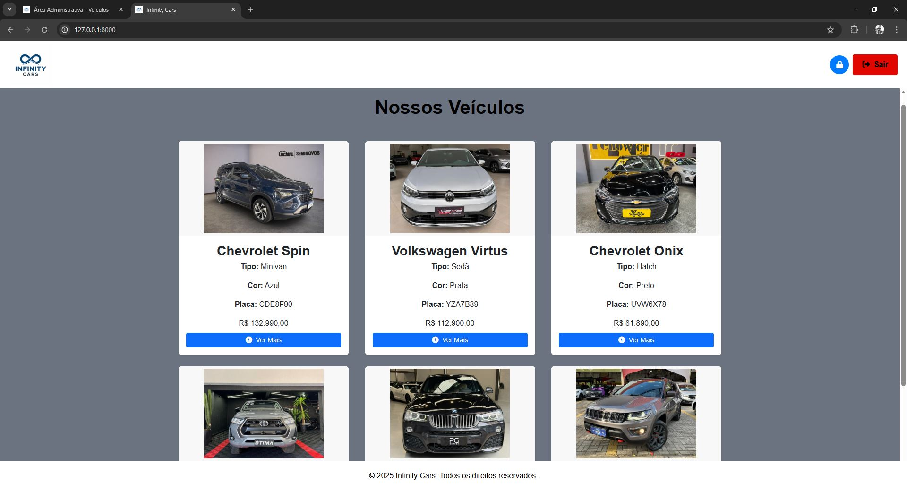
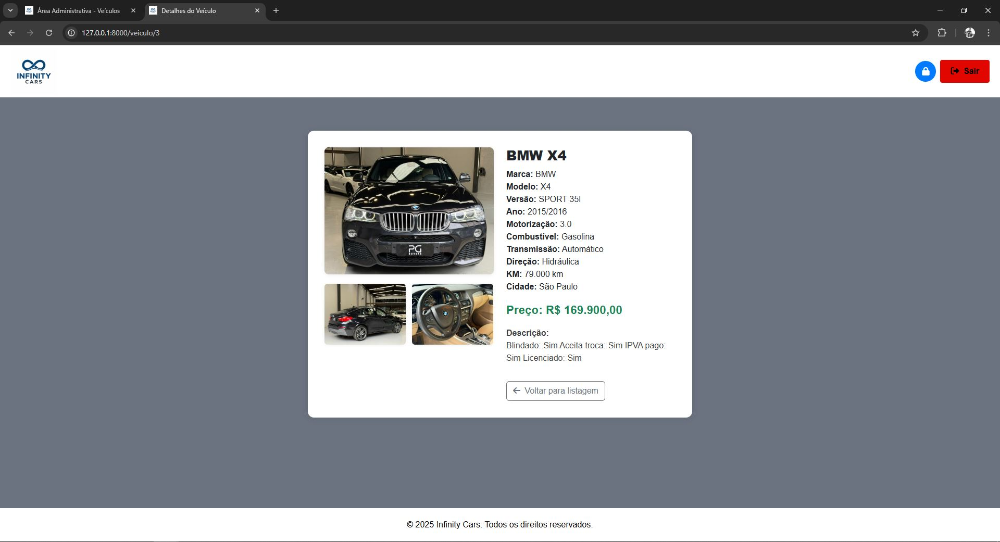

# 🚗 InfinityCars

Sistema web desenvolvido para o gerenciamento de veículos, vendas e estoque de uma concessionária.  
O **InfinityCars** permite o controle completo de automóveis, clientes e transações, proporcionando uma gestão eficiente e moderna.

---

## 🧭 Visão Geral

O projeto tem como objetivo principal **facilitar o gerenciamento de estoque e vendas de carros**, permitindo que administradores e funcionários controlem todas as operações de forma simples e segura.

Entre as principais funcionalidades, estão:
- Cadastro, edição e exclusão de veículos;
- Controle de estoque;
- Registro e acompanhamento de vendas;
- Interface moderna e responsiva com Bootstrap;
- Autenticação e controle de sessões com Laravel Breeze.

---

## 🛠 Tecnologias Utilizadas

| Categoria | Tecnologias |
|------------|-------------|
| Backend | **Laravel (PHP)** |
| Frontend | **HTML5, CSS3, JavaScript, Bootstrap** |
| Autenticação | **Laravel Breeze** |
| Banco de Dados | **MySQL** |
| Servidor local | **XAMPP / PHP Artisan** |

---

## ⚙️ Como Executar o Projeto

### 🔹 Pré-requisitos
Antes de começar, verifique se possui:
- PHP 8.1+  
- Composer  
- MySQL  
- Node.js e NPM  
- Git  

### 🔹 Passos para executar localmente

1. **Clone o repositório**
   ```bash
   git clone https://github.com/gcamargo182/InfinityCars.git
   cd InfinityCars
composer install
npm install && npm run dev
DB_DATABASE=infinitycars
DB_DATABASE=infinitycars
DB_USERNAME=root
DB_PASSWORD=
Copy-Item .env.example .env
php artisan key:generate
php artisan migrate
php artisan serve
http://localhost:8000

## 🖥️ Telas do Sistema

<p align="center">
  
  
</p>

